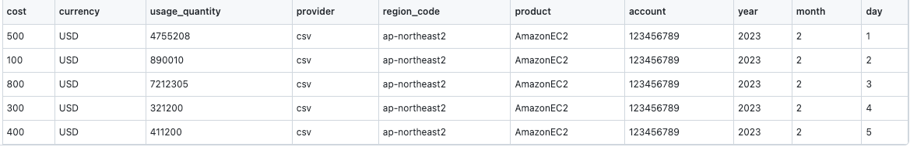

# plugin-http-file-cost-datasource

* Plugin for collecting cost data from **CSV file**

---

## 1) Overview

This plugin is a plugin that collects cost data from a CSV file. The CSV file must be in the format specified in
the [2) CSV format](#2-csv-format) section.    
The CSV file must be located on the web server, and the URL of the CSV file must be specified in
the [3) options of the plugin](#3-options-of-plugin).  
If you have completed understanding the steps 1) and 2), you can check the actual usage
in [4) How to use](#4-how-to-use).

## 2) CSV format



* The above is an example of a csv file, and the fields that exist in the csv must exist.
* Here is a list of available fields.
  Of these, `cost`, `currency`, `year`, `month`, and `day` fields are required fields.
    * **cost (required)**
    * **currency (required)**
    * **year (required)**
    * **month (required)**
    * **day (required)**
    * usage_quantity
    * usage_type
    * provider
    * region_code
    * product
    * account

## 3) Options of plugin

* The following options are available for the plugin.
* The options are specified in the form of a YAML file.
* You can find out how yaml is used in [3) How to use](#3-how-to-use) section.
* An example using all options is shown below.
  ```yaml
  # update_data_source_options.yml
  ---
  options:
    base_url:
    - https://raw.githubusercontent.com/cloudforet-io/plugin-http-file-cost-datasource/master/examples/cost_example.csv
    - https://raw.githubusercontent.com/cloudforet-io/plugin-http-file-cost-datasource/master/examples/custom_cost_example.csv
    - https://raw.githubusercontent.com/cloudforet-io/plugin-http-file-cost-datasource/master/examples/example_with_billed_at.csv
    - https://raw.githubusercontent.com/cloudforet-io/plugin-http-file-cost-datasource/master/examples/examples_of_different_headers.csv
    field_mapper:
      cost: TotalCost
      currency: CurrencyCode
      day: Day
      month: Month
      provider: Provider
      usage_quantity: UsageQuantity
      usage_type: UsageType
      year: Year
    default_vars:
      currency: KRW
    billed_at: UsageStartDate
  ```

**base_url (required)**

* The URL of the CSV file to be used.
* The URL must be a list type.

```yaml
---
options:
  base_url:
    - https://raw.githubusercontent.com/cloudforet-io/plugin-http-file-cost-datasource/master/examples/cost_example.csv
    - https://raw.githubusercontent.com/cloudforet-io/plugin-http-file-cost-datasource/master/examples/custom_cost_example.csv
    - https://raw.githubusercontent.com/cloudforet-io/plugin-http-file-cost-datasource/master/examples/example_with_billed_at.csv
    - https://raw.githubusercontent.com/cloudforet-io/plugin-http-file-cost-datasource/master/examples/examples_of_different_headers.csv
```

**field_mapper (optional)**

* The field name of the CSV file to be used.
* If you do not specify this option, the [default column](#2-csv-format) is used.
* As you can see in [examples_of_different_headers.csv](examples/examples_of_different_headers.csv), if the column names
  are different, you can use these options to map them.

```yaml
---
options:
  field_mapper:
    cost: TotalCost
    currency: CurrencyCode
    day: Day
    month: Month
    provider: Provider
    usage_quantity: UsageQuantity
    usage_type: UsageType
    year: Year
```

**default_vars (optional)**

* If you want to set a default value for a field, you can use this option.
* If you do not specify this option, the [default column](#2-csv-format) is used.
* As you can see in [example_of_default_vars.csv](examples/example_of_default_vars.csv), This can be used if you want to
  default all currencies to KRW.

```yaml
---
options:
  default_vars:
    currency: KRW
```

**billed_at (optional)**

* If you want to set the billing date, you can use this option.
* If you do not specify this option, The `year` / `month` / `day` columns must exist.
* As you can see in [example_with_billed_at.csv](examples/example_with_billed_at.csv), Can be used if billed_at column
  exists. In our example, this is the `UsageStartDate` column.

```yaml
---
options:
  billed_at: UsageStartDate
```

## 4) How to use

In order to use the plugin, how to use [spacectl CLI tools](https://github.com/cloudforet-io/spacectl) must be preceded.

1. Check if the plugin you want to use from the marketplace exists.

```shell
$ spacectl list repository.Plugin -p service_type=cost_analysis.DataSource --minimal

plugin_id                        | name                                | image                                     | state   | service_type             | registry_type
----------------------------------+-------------------------------------+-------------------------------------------+---------+--------------------------+-----------------
plugin-http-file-cost-datasource | HTTP file Cost Analysis Data Source | pyengine/plugin-http-file-cost-datasource | ENABLED | cost_analysis.DataSource | DOCKER_HUB
```

2. Register with the DataSource resource of cost-analysis.

```shell
$ spacectl exec register cost-analysis.DataSource -f register_data_source.yml
```

```yaml
# register_data_source.yml
---
name: HTTP File Data Source
service_type: EXTERNAL
image: pyengine/plugin-http-file-cost-datasource
tags: { }
template: { }
```

3. Check the registered CSV Plugin information.

```shell
$ spacectl exec get cost-analysis.DataSource -p data_source_id=<data_source_id>

---
created_at: '2023-02-06T11:04:34.348Z'
data_source_id: ds-123456789012
data_source_type: EXTERNAL
domain_id: domain-123456789012
last_synchronized_at: '2023-02-06T16:00:08.356Z'
name: HTTP File Data Source
plugin_info:
  metadata:
    data_source_rules:
    - actions:
        match_service_account:
          source: account
          target: data.account
      conditions: []
      conditions_policy: ALWAYS
      name: match_service_account
      options:
        stop_processing: true
      tags: {}
  plugin_id: plugin-http-file-cost-datasource
  upgrade_mode: AUTO
  version: 1.0.0.20230206.225536
state: ENABLED
tags: {}
template: {}
```

4. Sets the options corresponding to the url where the csv file is located in the plugin.

```shell
$ spacectl exec update_plugin cost-analysis.DataSource -p data_source_id=<data_source_id> -f update_data_source_options.yml
```

```yaml
# update_data_source_options.yml
---
options:
  base_url:
  - https://raw.githubusercontent.com/cloudforet-io/plugin-http-file-cost-datasource/master/examples/cost_example.csv
  - https://raw.githubusercontent.com/cloudforet-io/plugin-http-file-cost-datasource/master/examples/custom_cost_example.csv
  - https://raw.githubusercontent.com/cloudforet-io/plugin-http-file-cost-datasource/master/examples/example_with_billed_at.csv
  - https://raw.githubusercontent.com/cloudforet-io/plugin-http-file-cost-datasource/master/examples/examples_of_different_headers.csv
  field_mapper:
    cost: TotalCost
    currency: CurrencyCode
    day: Day
    month: Month
    provider: Provider
    usage_quantity: UsageQuantity
    usage_type: UsageType
    year: Year
  default_vars:
    currency: KRW
  billed_at: UsageStartDate
```

5. Manually sync the cost information of the csv file in step 4.

```shell
$ spacectl exec sync cost-analysis.DataSource -p data_source_id=<data_source_id>
```